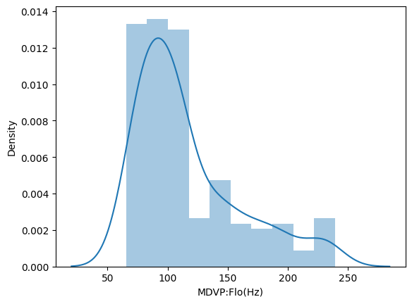
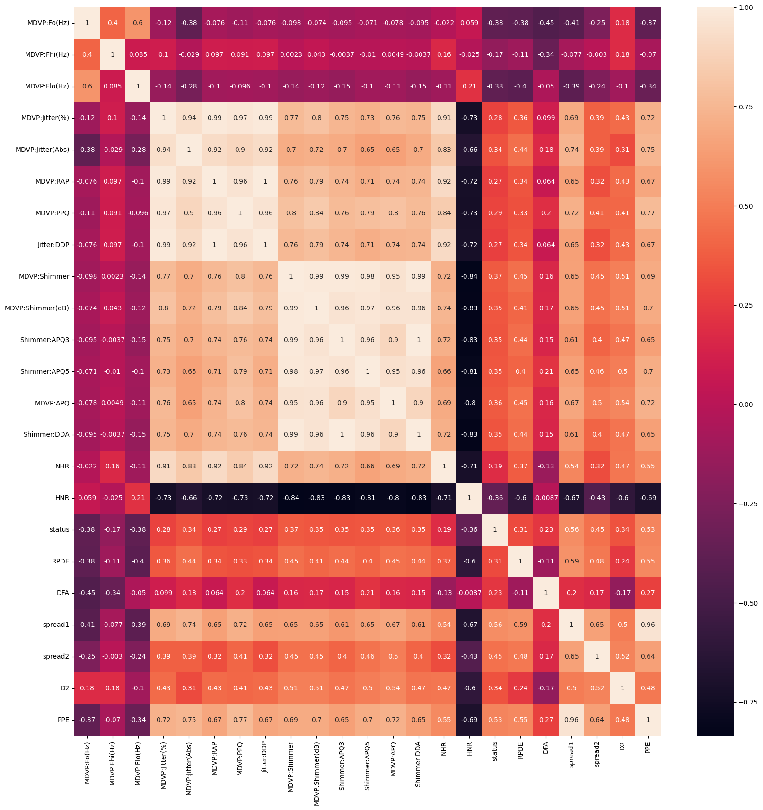
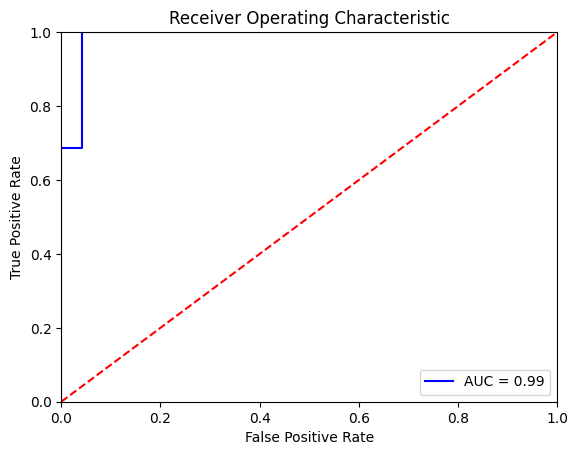

# Detecting Parkinson’s Disease using Machine Learning

Parkinson’s Disease (PD) is a progressive neurodegenerative disorder that affects movement, speech, and coordination due to the loss of dopamine-producing neurons in the brain. Early and accurate detection can significantly improve symptom management and quality of life.

This project uses **machine learning techniques** to detect Parkinson’s Disease based on **biomedical voice measurements**, using the well-known **UCI Parkinson’s dataset**.

---

## 📖 Problem Statement

Parkinson’s Disease is chronic, progressive, and currently incurable. Traditional diagnosis relies heavily on clinical observation, which can be subjective and may miss early-stage symptoms.  

**Objective:**  
To build and evaluate machine learning models that can **accurately classify whether a person has Parkinson’s Disease** using voice-related features. :contentReference[oaicite:2]{index=2}

---

## 🧠 About Parkinson’s Disease

Parkinson’s Disease affects dopamine-producing neurons in the **substantia nigra** region of the brain. Common symptoms include tremors, rigidity, bradykinesia, gait imbalance, and speech impairments.  

Recent research focuses on identifying **biomarkers** that enable early diagnosis using computational methods. :contentReference[oaicite:3]{index=3}

---

## 📊 Dataset Description

- **Source:** UCI Machine Learning Repository  
- **Records:** 195  
- **Features:** 23 biomedical voice measurements  
- **Target Variable:** `status`
  - `1` → Parkinson’s Disease
  - `0` → Healthy

Key features include:
- Fundamental frequency (MDVP:Fo, MDVP:Fhi, MDVP:Flo)
- Jitter and shimmer measures
- Harmonics-to-noise ratio (HNR)
- Nonlinear dynamical features

---

## 🔍 Exploratory Data Analysis (EDA)

### 🔹 Pairwise Feature Relationships


### 🔹 Feature Distributions & Outliers


### 🔹 Correlation Heatmap
Highly correlated voice features indicate strong relationships useful for classification.


---

## ⚙️ Methodology

1. Loaded dataset and removed non-informative columns
2. Separated features and labels (`status`)
3. Normalized features using **MinMaxScaler**
4. Split data into training and testing sets (80/20)
5. Trained and evaluated multiple ML models

---

## 🤖 Machine Learning Models Used

- Logistic Regression  
- Decision Tree  
- Random Forest  
- Support Vector Machine (SVM)  
- K-Nearest Neighbors (KNN)  
- Gradient Boosting  
- XGBoost  
- Voting Classifier (Ensemble)

---

## 📈 Model Performance Comparison


| Model | Accuracy |
|------|----------|
| Logistic Regression | ~85% |
| Decision Tree | ~97% |
| Random Forest | ~99% |
| SVM | ~98% |
| KNN | ~99% |
| XGBoost | ~92% |
| Voting Classifier | ~90% |

---

## 🧪 Evaluation Metrics

- Accuracy
- Precision
- Recall
- F1-score
- Confusion Matrix

### 🔹 Confusion Matrix Example


---

## 🏆 Key Results

- Achieved **up to 99% accuracy** using ensemble and tree-based models
- Strong predictive power from voice-based biomedical features
- Demonstrated effectiveness of ML for early Parkinson’s detection

---

## 🛠️ Tech Stack

- Python
- NumPy, Pandas
- Scikit-learn
- XGBoost
- Matplotlib, Seaborn
- Jupyter Notebook

---

## 🚀 How to Run the Project

```bash
git clone https://github.com/your-username/Detecting-Parkinsons-Disease.git
cd Detecting-Parkinsons-Disease
pip install -r requirements.txt
jupyter notebook
